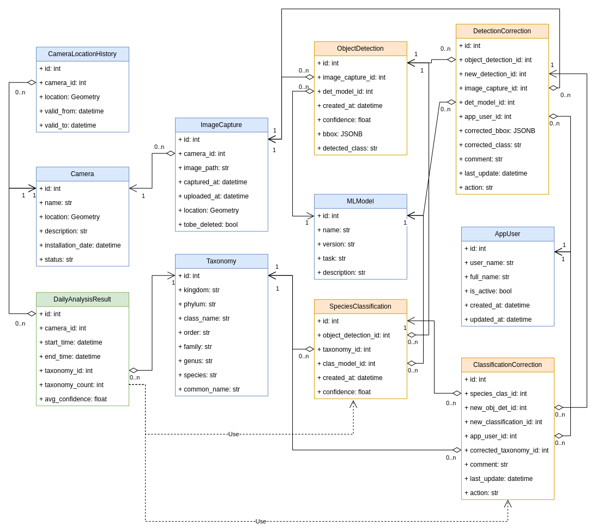

# Sentinel Rat Dashboard

Work in progress...

## Overview

R Shiny application for browsing animal detection results from PostgreSQL (PostGIS).

## Scaffolded code

* Initialize a PostgreSQL database with PostGIS extension
* Display results fetched from a database in a table

## Database

### Data Model

There are 11 tables in the database, which are defined in `src/dashboard/db/data_model.py`. The data model is illustrated in the following figure:



### Folder structure

```
src/dashboard/db/
├── database.py # set up the database connection and session
├── data_model.py # define the SQLAlchemy data model
├── crud.py # define the CRUD operations for the data model
├── utils.py # utility functions
├── <table_name>.py # define the CRUD operations for each table
```

CRUD operations are defined in general in `crud.py` and then specialized for each table in `<table_name>.py`, if needed.

**Note**:

* `camera.py` covers both `Camera` and `CameraLocationHistory` tables
* `detection.py` covers both `ObjectDetection` and `DetectionCorrection` tables
* `classification.py` covers both `SpeciesClassification` and `ClassificationCorrection` tables
* `analysis_result.py` contains the CRUD operations for the `DailyAnalysisResult` table. Data in this table can be used to generate reports for other intervals, e.g. weekly, monthly, or yearly.

Methods implemented in the CRUD classes are summarized in the following table:

* ✓ : implemented or overridden in the specialized CRUD class
* x : not allowed to use directly (raise `NotImplementedError`)
* . : inherited from `CRUDBase` and not overridden in the specialized CRUD class

| Class | add | select | get | filter | update | delete | other methods |
| --- | --- | --- | --- | --- | --- | --- | --- |
| CRUDBase | ✓ | ✓ | ✓ | ✓ | ✓ | ✓ |  |
| CameraCRUD | ✓ | . | . | . | ✓ | . |  |
| CameraLocationHistoryCRUD | x | . | . | . | x | x | `add_location_change`,<br> `get_by_camera`,<br> `update_valid_to_most_recent_history`,<br> `delete_old_camera_history` |
| ImageCRUD | ✓ | . | . | . | x | . | `get_images_to_delete`,<br> `get_images_in_period`,<br> `mark_image_for_deletion` |
| MLModelCRUD | . | . | . | . | . | . |  |
| ObjectDetectionCRUD | ✓ | . | . | . | x | . |  |
| TaxonomyCRUD | . | . | . | . | . | . |  |
| SpeciesClassificationCRUD | ✓ | . | . | . | x | . |  |
| AppUserCRUD | ✓ | . | . | . | ✓ | . |  |
| DetectionCorrectionCRUD | ✓ | . | . | . | ✓ | . |  |
| ClassificationCorrectionCRUD | ✓ | . | . | . | ✓ | . |  |
| DailyAnalysisResultCRUD | . | . | . | . | . | . |  |


## Development
### Install dependencies

For Python depencencies, run the following command:
```bash
pip install -e .[dev]
```

For R dependencies, make sure you have R and its dependencies installed:
```bash
sudo apt update
sudo apt install r-base
sudo apt-get install -y \
            libpq-dev \
            libssl-dev \
            libuv1-dev
```

Create a folder to install R packages, if needed:
```bash
mkdir -p ~/R/library
export R_LIBS_USER=~/R/library
```

Then, install R packages:
```bash
Rscript install.R
```

### Testing

For Python tests, the PostgreSQL database is handled by `testcontainers`'s `PostgresContainer` as configured in `tests/conftest.py`. To run the tests, use the following command:
```bash
pytest tests/
```

To run R tests, we first need to set up the database. **There might be a simpler way to do this (TBU.)**
```bash
docker run --name sentinel-postgres \
  -e POSTGRES_DB=sentinel_db \
  -e POSTGRES_USER=sentinel_user \
  -e POSTGRES_PASSWORD=sentinel_pass \
  -p 5432:5432 \
  -d postgis/postgis:17-3.5
```

Check if the database is ready:
```bash
docker exec sentinel-postgres pg_isready -U sentinel_user -d sentinel_db
```

You should see the following output (on Linux):
```
/var/run/postgresql:5432 - accepting connections
```

Then set the environment variables for the database connection:
```bash
export POSTGRES_HOST=localhost
export POSTGRES_PORT=5432
export POSTGRES_DB=sentinel_db
export POSTGRES_USER=sentinel_user
export POSTGRES_PASSWORD=sentinel_pass
```

Initialize the database schema:
```bash
python src/dashboard/init_db.py
```

Finally, run the R tests:
```bash
Rscript -e 'source("src/dashboard/R/db.R"); library(testthat); test_dir("tests/testthat")'
```

Stop and remove the database container when done:
```bash
docker stop sentinel-postgres
docker rm sentinel-postgres
```